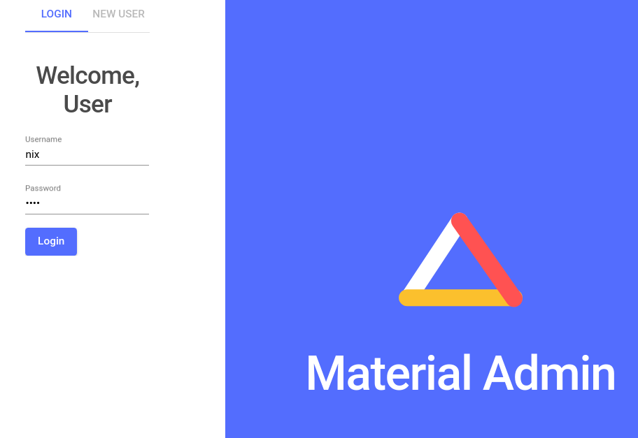
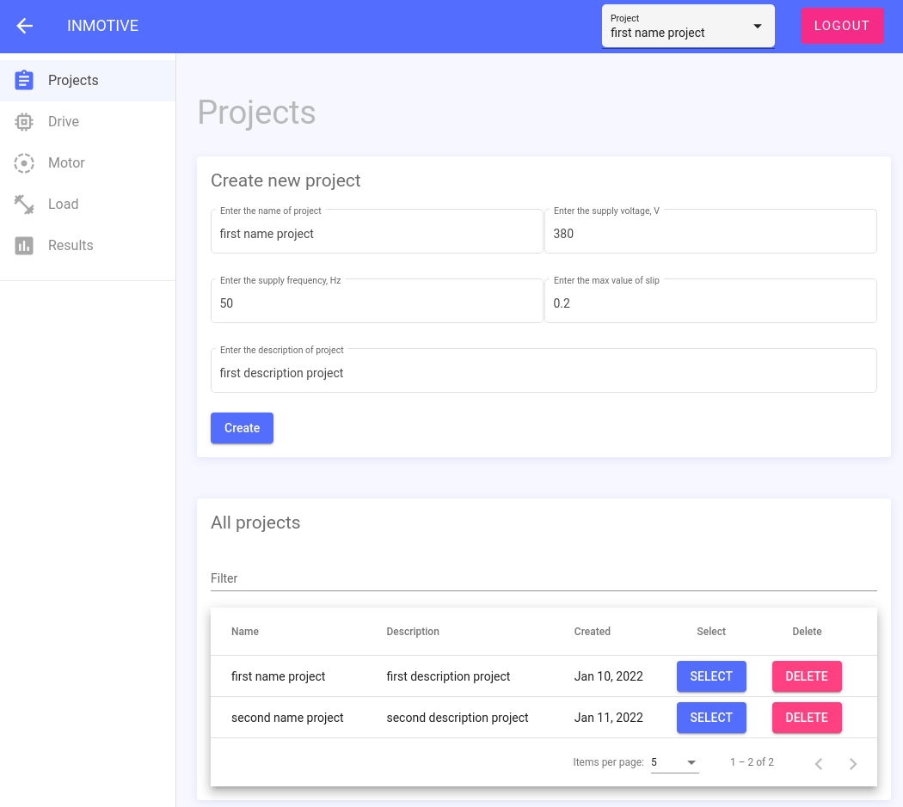
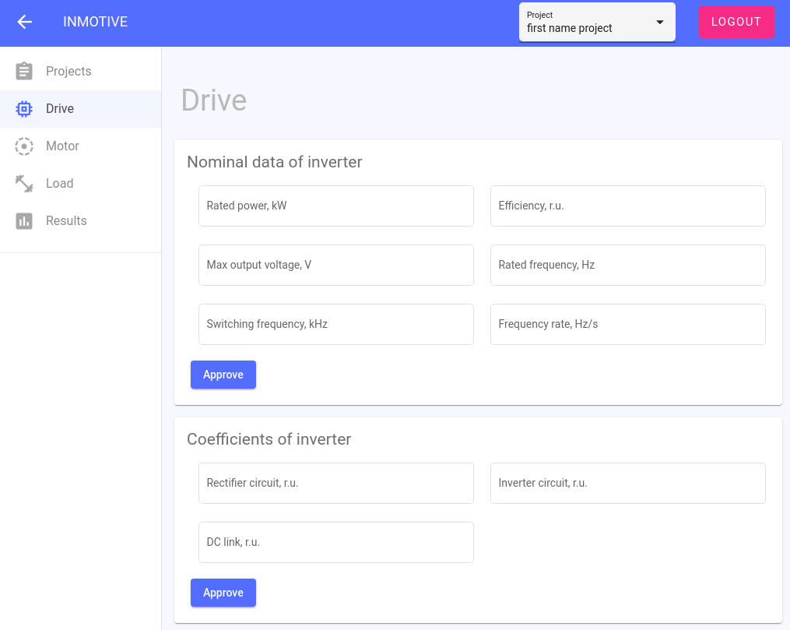
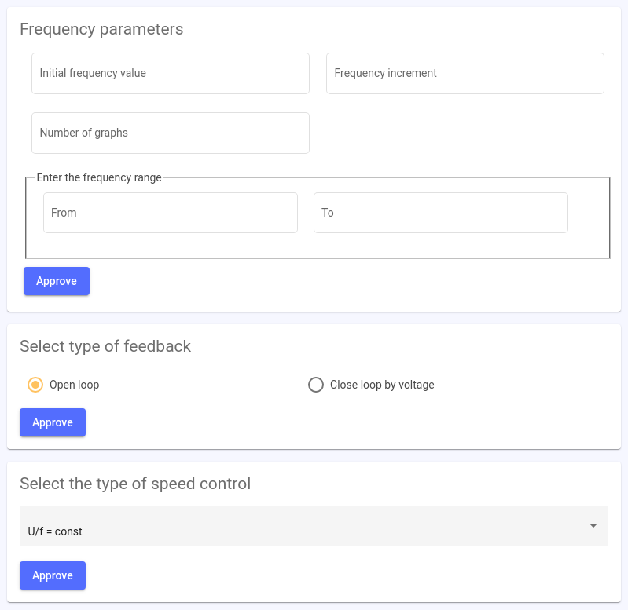
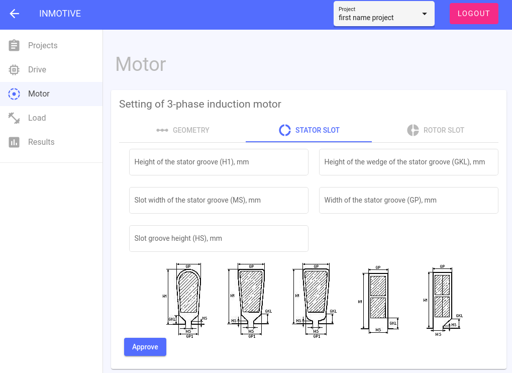
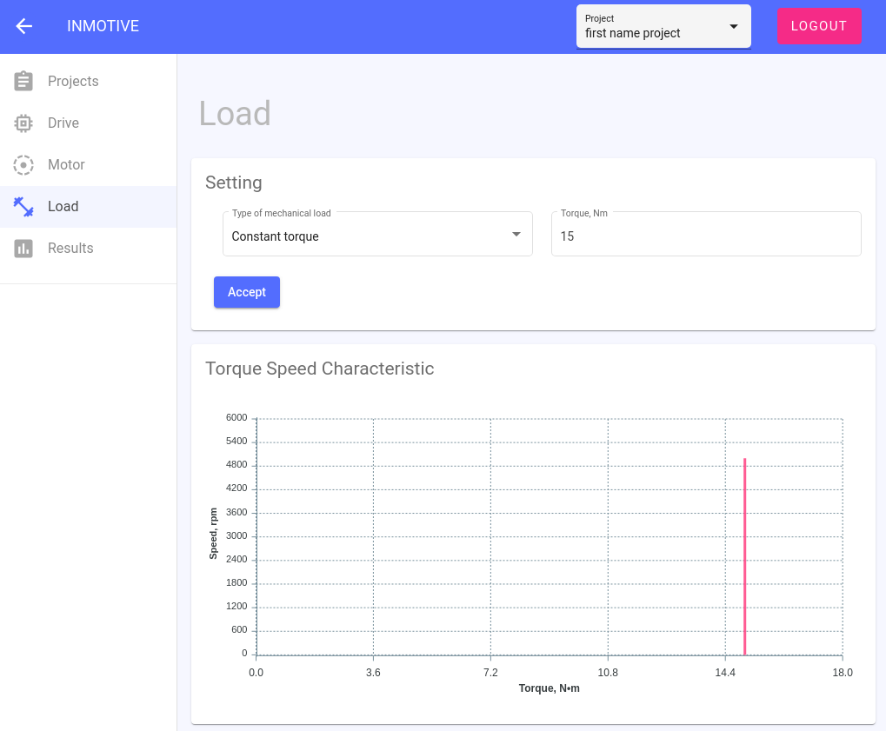
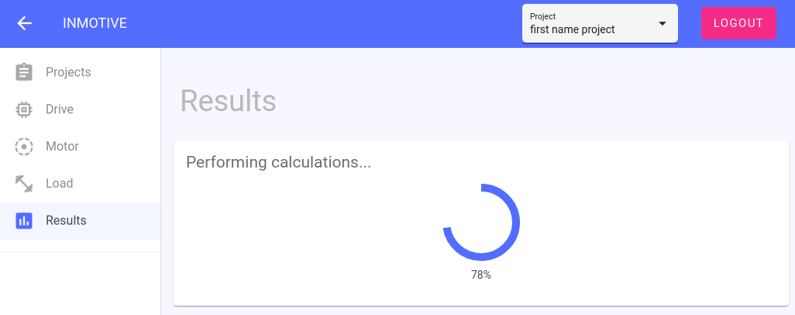
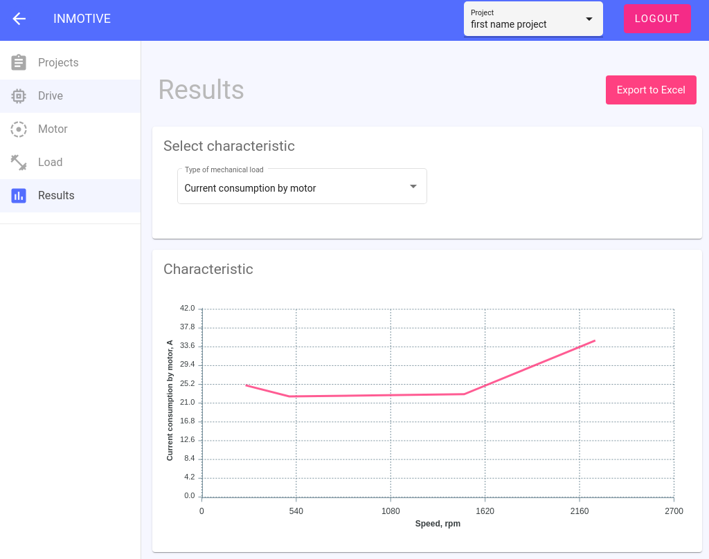
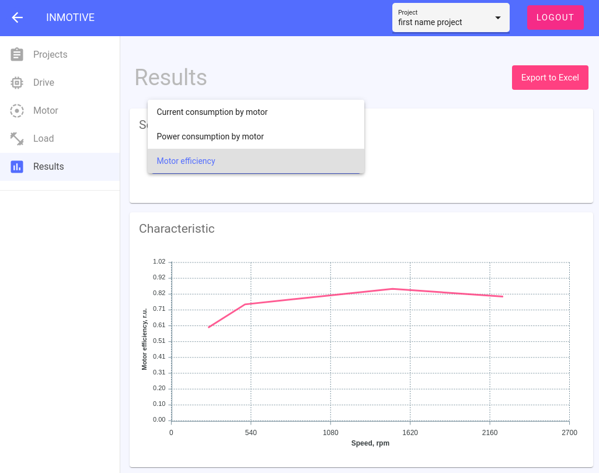

# inmotive-frontend
#### _The purpose of the web app 'inmotive' is to study the operation of induction motors in controlled semiconductor drive systems. Frontend part._
This client application is developed on top of the **Angular** framework. The [angular-material-admin][flatlogic] project was selected as a template, which has been rewritten to the tasks of the application. Authentication method chosen via **JSON Web Token** (JWT). And **apexcharts.js** library is used to display charts.

[flatlogic]: <https://github.com/flatlogic/angular-material-admin>
